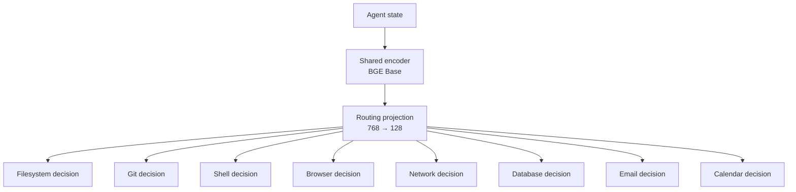
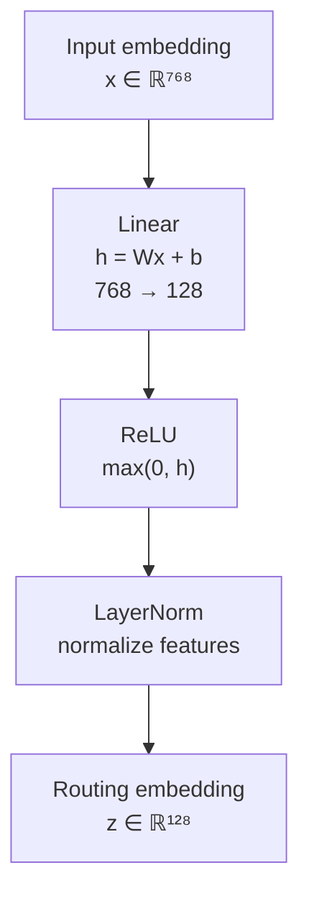

# Parallel Decider

A lightweight parallel decision engine for agent routing.

`parallel-decider` encodes an agent state once, then evaluates multiple typed decisions in parallel using a shared representation and a small learned routing head.

The project explores a simple question:

> Can an agent make many independent routing decisions cheaply after paying the cost of encoding its state only once?

The current implementation focuses on tool/capability routing such as:

- filesystem access
- Git access
- shell execution
- browser access
- network access
- database access
- email access
- calendar access

## Why

Agent systems often need to answer several small questions before taking action:

- Does this task need filesystem access?
- Does it require a shell?
- Should a browser be opened?
- Is database access necessary?
- Does the task require email or calendar access?

A straightforward approach can repeatedly process the same state for every decision.

Parallel Decider instead uses:




The capability hypotheses are also embedded once and reused.

## Usage

Load the included trained router:

```python
from parallel_decider import ParallelDecider

decider = ParallelDecider.from_checkpoint(
    "models/router-bge-base-v3.pt"
)

decisions = decider.decide(
    "Inspect the repository history and run the failing tests."
)

for decision in decisions:
    print(
        decision.name,
        decision.probability,
    )
```

Example output:

```text
needs_filesystem     1.000
needs_git            1.000
needs_shell          1.000
needs_browser        0.000
needs_network        0.000
needs_database       0.000
needs_email          0.000
needs_calendar       0.000
```

Batch decisions are also supported:

```python
results = decider.decide_many(
    [
        "Inspect the repository history.",
        "Search the official Python documentation.",
        "Draft an email but do not send it.",
    ]
)
```

## Command Line Usage

The package also provides a small command-line interface.

After installing the project:

```bash
pip install -e ".[dev]"
```

you can run:

```bash
parallel-decider \
  "Inspect the repository history and run the failing tests."
```

Example output:

```text
* needs_filesystem     1.000
* needs_git            1.000
* needs_shell          1.000
  needs_browser        0.000
  needs_network        0.000
  needs_database       0.000
  needs_email          0.000
  needs_calendar       0.000
```

An asterisk marks decisions whose probability meets the checkpoint threshold.

To show only active capabilities:

```bash
parallel-decider \
  --active-only \
  "Find the latest email from the supplier and schedule a follow-up meeting."
```

Example output:

```text
* needs_network        1.000
* needs_email          1.000
* needs_calendar       1.000
```

A specific checkpoint can be selected with:

```bash
parallel-decider \
  --checkpoint models/router-bge-base-v3.pt \
  "Search the official Python documentation for asyncio task groups."
```

The execution device can also be selected explicitly:

```bash
parallel-decider \
  --device cpu \
  "Explain what git rebase does."
```

or:

```bash
parallel-decider \
  --device cuda \
  "Inspect the repository and run the tests."
```

By default, the CLI uses:

```text
models/router-bge-base-v3.pt
```

and automatically selects CUDA when available.

## Architecture

The current router contains three main components.

### 1. Frozen sentence encoder

The selected encoder is:

```text
BAAI/bge-base-en-v1.5
```

The encoder produces a shared state representation.

The current V3 checkpoint keeps the encoder frozen during router training.

### 2. Learned routing projection

The encoder representation is mapped into a routing-specific latent space:




This allows the system to learn a representation specialized for capability decisions without fine-tuning the full sentence encoder.

### 3. Two-tower decision head

Each state embedding is compared with each capability hypothesis using:

```text
state
question
|state - question|
state * question
```

These features are passed through a small neural decision head that produces one logit per capability.

The state is therefore encoded once while many capability decisions can be evaluated cheaply.

## Example Routing Behavior

Input:

```text
Search the official Python documentation for asyncio task groups.
```

Result:

```text
browser  → high
network  → high
others   → low
```

Input:

```text
Draft an email asking for an update, but do not send it.
```

Result:

```text
email    → low
network  → low
```

Input:

```text
Find the latest email from the supplier and schedule a follow-up meeting.
```

Result:

```text
network   → high
email     → high
calendar  → high
```

The distinction between mentioning a capability and actually requiring access to it is an important part of the training data.

## Experiments

The repository contains the experimental path that led to the current architecture.

| Notebook | Experiment |
| --- | --- |
| `00_single_decision.ipynb` | Single NLI decision baseline |
| `01_batched_decisions.ipynb` | Batched decisions |
| `02_sequential_vs_batched.ipynb` | Sequential vs batched latency |
| `03_shared_state_exploration.ipynb` | Shared-state representation analysis |
| `04_two_tower_baseline.ipynb` | Two-tower routing baseline |
| `05_routing_v2.ipynb` | Dataset and projection experiments |
| `06_encoder_comparison.ipynb` | Encoder quality and latency comparison |
| `07_final_evaluation.ipynb` | Frozen holdout evaluation |
| `08_dataset_scaling.ipynb` | Controlled dataset-scaling study |

## Encoder Comparison

Six frozen sentence encoders were tested using the same projection and decision-head architecture.

On the development benchmark:

| Encoder | Dim | Accuracy | Macro F1 | Median encoder latency |
| --- | ---: | ---: | ---: | ---: |
| MiniLM L6 v2 | 384 | 99.1% | 0.989 | 4.40 ms |
| BGE Small EN v1.5 | 384 | 99.1% | 0.982 | 7.61 ms |
| E5 Small v2 | 384 | 98.2% | 0.949 | 7.95 ms |
| MPNet Base v2 | 768 | 98.2% | 0.964 | 8.69 ms |
| **BGE Base EN v1.5** | 768 | **100.0%** | **1.000** | 7.77 ms |
| GTE ModernBERT Base | 768 | 98.2% | 0.947 | 14.62 ms |

These numbers are development metrics, not final generalization estimates.

## End-to-End Latency

Measured on an RTX 3070 with eight capability decisions:

| Encoder | Encoder median | Full routing median | Routing overhead |
| --- | ---: | ---: | ---: |
| MiniLM | 4.404 ms | 5.177 ms | 0.773 ms |
| BGE Base | 7.765 ms | 8.394 ms | 0.629 ms |

The projection and parallel decision head add less than 1 ms in this benchmark.

Most runtime is therefore spent in the shared encoder rather than in evaluating the individual routing decisions.

## Frozen Holdout Evaluation

After encoder and architecture selection, the selected models were evaluated on a separate 40-request holdout containing 320 capability decisions.

The holdout was not used for:

- training
- encoder selection
- threshold selection
- architecture selection
- error-targeted augmentation

Results:

| Model | Accuracy | Macro Precision | Macro Recall | Macro F1 |
| --- | ---: | ---: | ---: | ---: |
| MiniLM | 92.50% | 0.854 | 0.822 | 0.819 |
| **BGE Base** | **96.88%** | **0.964** | **0.884** | **0.914** |

BGE Base made 10 incorrect decisions out of 320, compared with 24 for MiniLM.

This result belongs to the earlier frozen-holdout evaluation and is kept as a historical generalization result rather than reused for V3 tuning.

## Dataset Scaling

The V3 training corpus contains 497 examples.

A controlled scaling experiment fixed the optimizer budget at 20,000 updates and evaluated each training size over three random seeds using a separate 48-example V3 validation set.

| Training examples | Mean accuracy | Mean macro F1 |
| ---: | ---: | ---: |
| 74 | 94.18% | 0.860 |
| 150 | 95.66% | 0.913 |
| 250 | 96.09% | 0.920 |
| 497 | **96.44%** | **0.921** |

The largest improvement occurs between 74 and 150 examples.

Performance continues improving after that, but with strongly diminishing returns.

The experiment also showed that dataset diversity matters more than simply generating additional surface-level paraphrases.

## V3 Capability Performance

For the full 497-example corpus, averaged over three random seeds:

| Capability | Precision | Recall | F1 |
| --- | ---: | ---: | ---: |
| Browser | 0.766 | 0.889 | 0.820 |
| Shell | 1.000 | 0.750 | 0.857 |
| Filesystem | 0.967 | 0.873 | 0.917 |
| Network | 0.928 | 0.913 | 0.920 |
| Email | 1.000 | 0.889 | 0.941 |
| Git | 0.963 | 0.958 | 0.958 |
| Database | 1.000 | 0.926 | 0.958 |
| Calendar | 1.000 | 1.000 | 1.000 |

The remaining weaknesses are not uniform.

Browser routing tends toward false positives, while shell routing is conservative and primarily produces false negatives.

## Repository Structure

```text
parallel-decider/
├── data/
│   ├── routing_v2.jsonl
│   ├── routing_v3.jsonl
│   ├── routing_v3_candidates.jsonl
│   ├── routing_v3_expanded.jsonl
│   ├── routing_v3_training.jsonl
│   ├── routing_v3_validation.jsonl
│   ├── routing_benchmark.jsonl
│   └── routing_final_test.jsonl
│
├── models/
│   └── router-bge-base-v3.pt
│
├── notebooks/
│   ├── 00_single_decision.ipynb
│   ├── ...
│   └── 08_dataset_scaling.ipynb
│
├── scripts/
│   ├── generate_routing_dataset.py
│   └── train_v3_checkpoint.py
│
├── src/
│   └── parallel_decider/
│       ├── backend.py
│       ├── checkpoint.py
│       ├── dataset.py
│       ├── decision.py
│       ├── nli_backend.py
│       ├── parallel_decider.py
│       ├── projection.py
│       ├── question.py
│       └── two_tower.py
│
└── tests/
```

## Installation

Create a virtual environment and install the package in editable mode:

```bash
python -m venv .venv
source .venv/bin/activate

pip install -e ".[dev]"
```

Run the test suite:

```bash
pytest -q
```

## Training

The included V3 checkpoint can be reproduced with:

```bash
python scripts/train_v3_checkpoint.py
```

Dataset candidates can be regenerated with:

```bash
python scripts/generate_routing_dataset.py
```

## Design Principles

The project intentionally keeps the architecture small.

The goal is not to replace a general-purpose language model. It is to provide a cheap typed decision layer that can sit in front of more expensive agent actions.

Key design choices include:

- encode state once
- reuse static question embeddings
- keep the sentence encoder frozen
- train only a small routing projection and head
- make decisions independent and typed
- keep the encoder configurable
- separate development validation from final holdout evaluation

## Limitations

The project is currently a research prototype.

Important limitations include:

- the training corpus is small compared with production classification systems
- much of the V3 corpus is synthetically structured
- capability definitions are currently fixed
- the current router uses a global probability threshold
- calibration has not yet been studied
- confidence values should not be interpreted as calibrated probabilities
- the frozen-holdout experiment contains only 40 requests
- V3 has not yet been evaluated on a new untouched post-V3 final holdout
- the current checkpoint is specialized for the eight routing capabilities used in the experiments

## Future Work

Potential next steps include:

- probability calibration
- per-capability thresholds
- cost-sensitive routing
- larger and more diverse human-reviewed datasets
- longer agent-state benchmarks
- checkpoint metadata/versioning
- CLI support
- dynamic capability definitions
- partial encoder fine-tuning
- additional routing backends
- integration into agent frameworks

## Motivation

This project was inspired by the broader idea of performing many typed decisions over a shared state representation.

The implementation and experiments here are independent and focus on exploring that design using openly available sentence encoders and a small trainable routing architecture.

## License

MIT